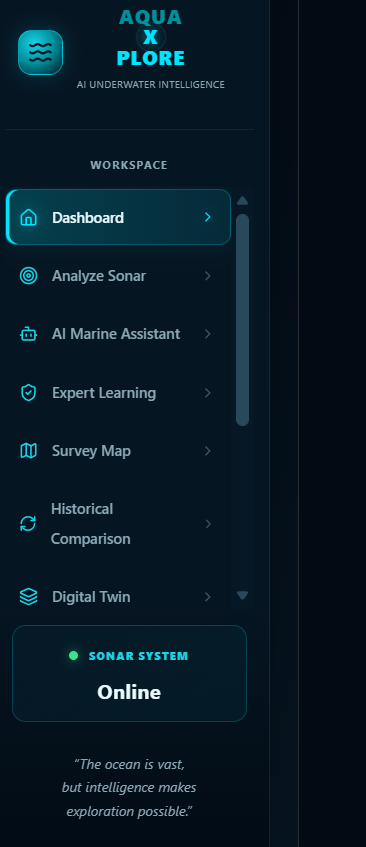
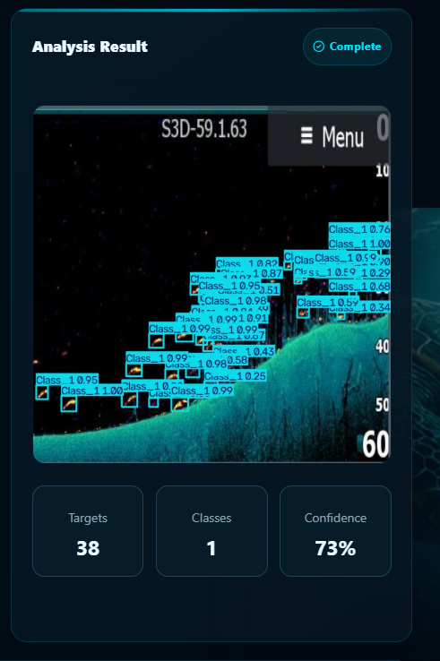
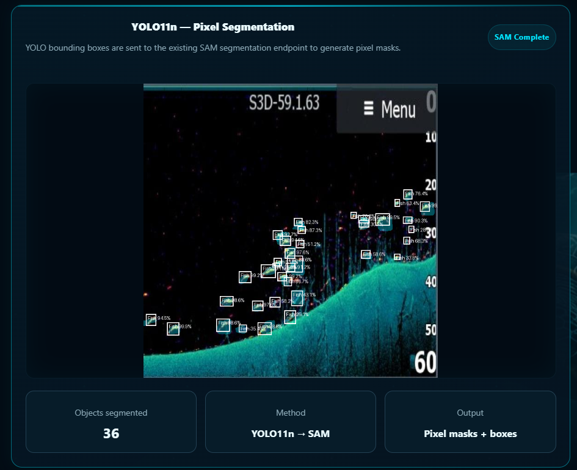
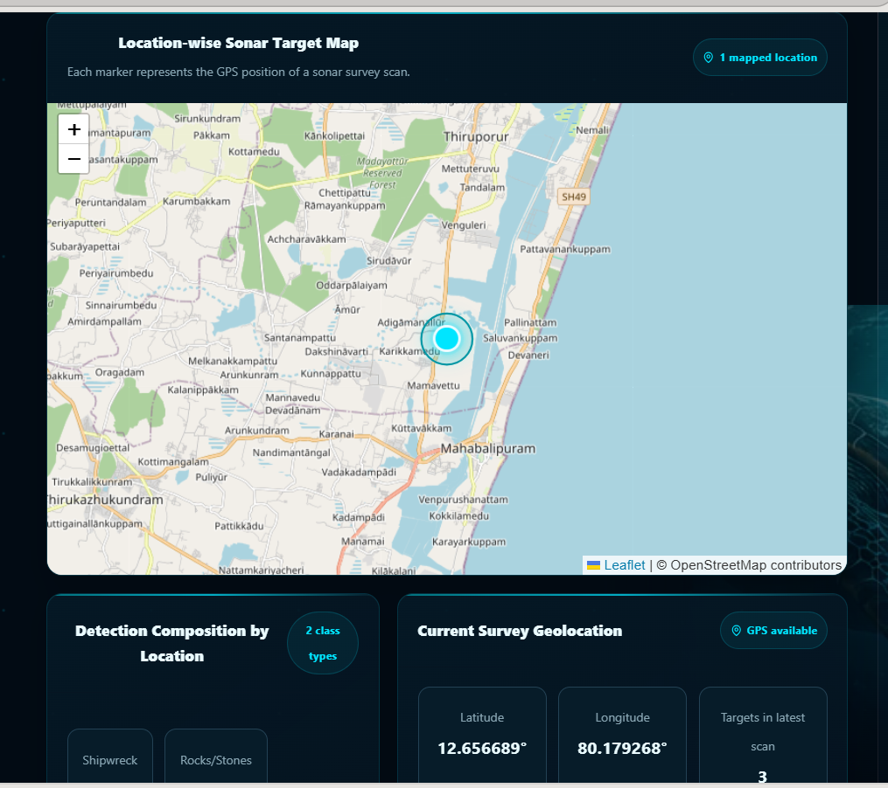
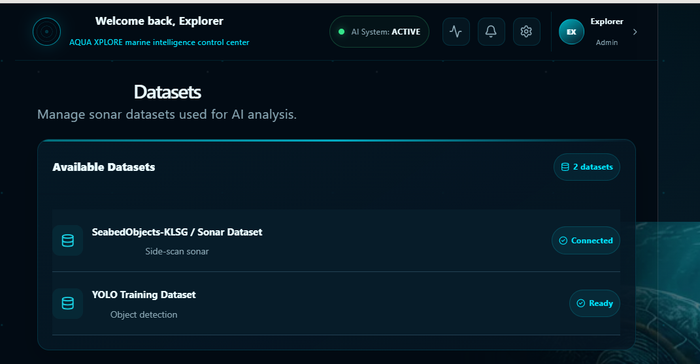
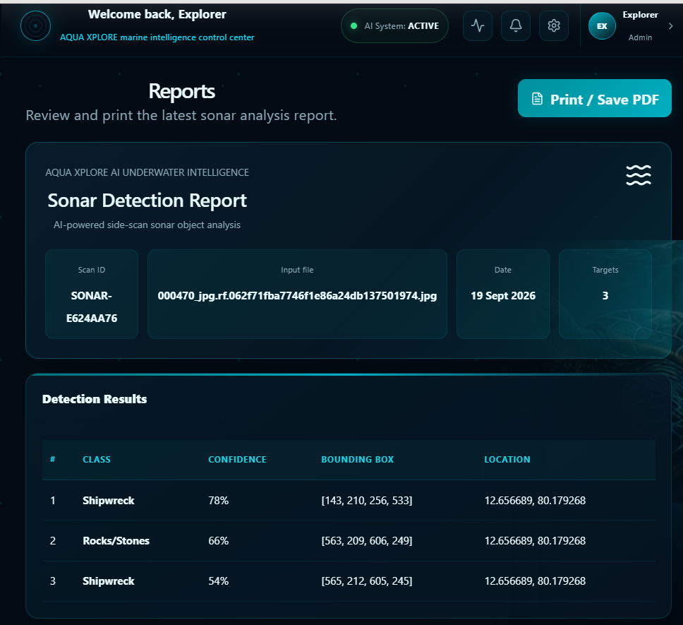
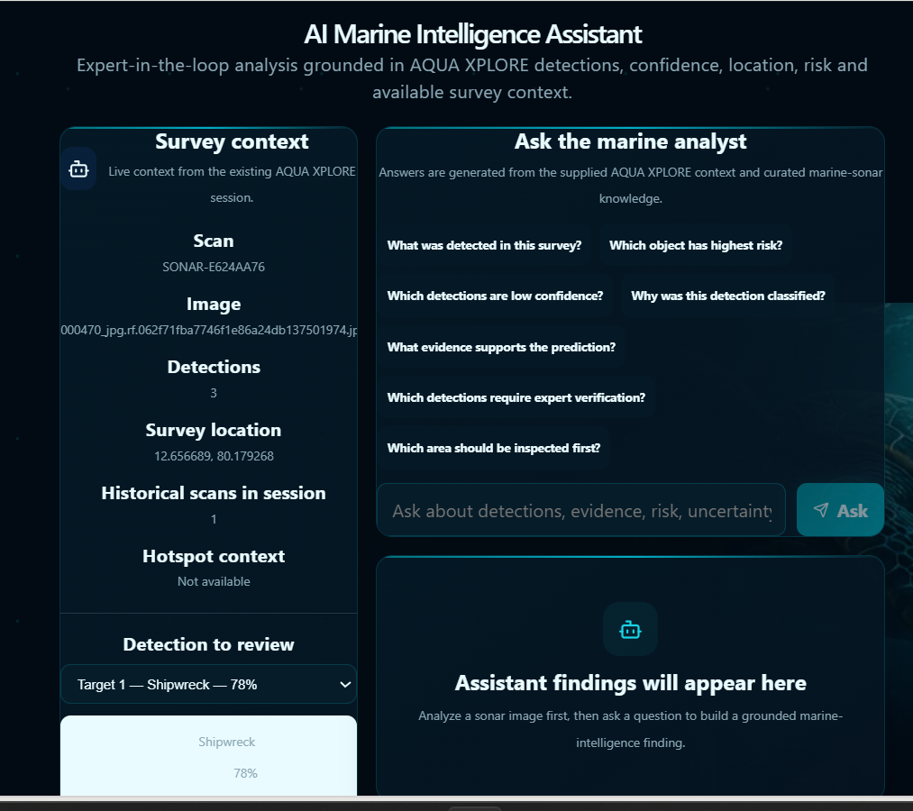
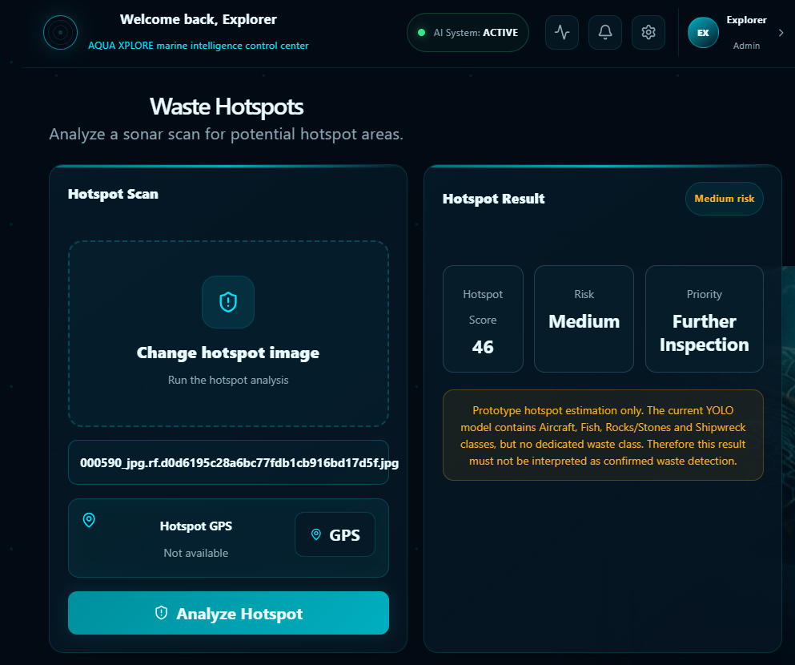
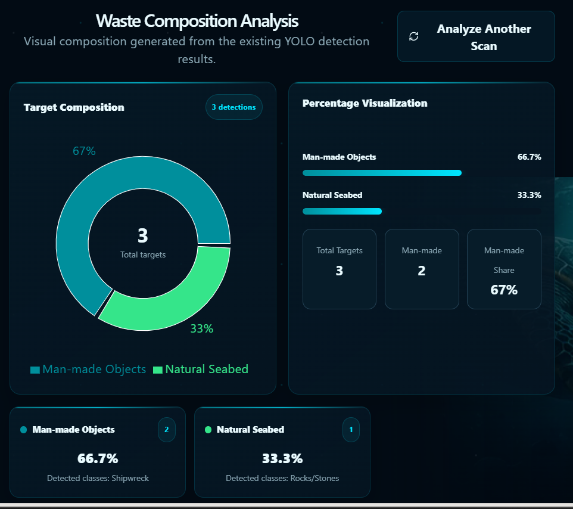
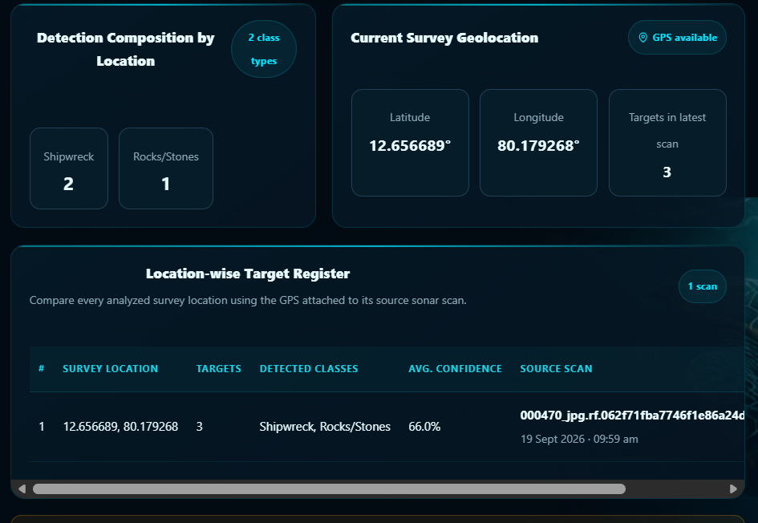

# SONAR-X

## Underwater Marine Object Detection and Intelligence System

SONAR-X is an AI-powered underwater intelligence platform designed to analyze Side-Scan Sonar (SSS) data and identify potential man-made objects and underwater anomalies.

The system combines computer vision, deep learning, object detection, image segmentation, geospatial analysis, and an interactive web dashboard to assist marine authorities and researchers in understanding underwater environments.

---

## SIH Problem Statement

**SIH26057**

Given underwater Side-Scan Sonar data, automatically identify man-made objects, distinguish them from natural seabed structures, determine their location, estimate detection confidence/severity, and generate actionable information for marine authorities.

---

## Key Features

- Side-Scan Sonar image analysis
- AI-based underwater object detection
- YOLO-based detection
- Faster R-CNN-based detection
- YOLO-based segmentation
- Underwater anomaly identification
- Confidence estimation
- Survey map visualization
- Geotagging support
- Waste hotspot analysis
- Waste composition analysis
- Location-wise analysis
- AI Marine Assistant
- Historical comparison
- Digital Twin visualization
- Detection reports
- Interactive marine intelligence dashboard

---

## Technology Stack

### Frontend

- React
- Vite
- JavaScript
- Lucide React
- HTML/CSS

### Backend

- Python
- FastAPI
- Uvicorn

### AI / Machine Learning

- YOLO
- Faster R-CNN
- ResNet-50 FPN
- YOLO Segmentation
- Computer Vision
- Image Segmentation

---

## System Architecture

```text
Side-Scan Sonar Data
        |
        v
   Data Processing
        |
        v
+-----------------------+
| AI Detection Models   |
|                       |
| YOLO                  |
| Faster R-CNN          |
+-----------------------+
        |
        v
   Segmentation
        |
        v
Object / Anomaly Analysis
        |
        +----------------+
        |                |
        v                v
 Survey Map         Intelligence
 Visualization      & Reports
        |
        v
Marine Authority Dashboard
```

---

## Project Structure

```text
SONAR-X/
│
├── backend/
│   ├── assistant/
│   ├── rcnn/
│   ├── segmentation.py
│   ├── advanced_intelligence.py
│   └── main.py
│
├── frontend/
│   ├── src/
│   │   ├── App.jsx
│   │   ├── main.jsx
│   │   └── index.css
│   │
│   ├── package.json
│   └── vite.config.js
│
├── dataset/
│
├── docs/
│   └── images/
│       ├── dashboard.png
│       ├── analyze.png
│       └── segmentation.png
│
├── prepare_dataset.py
├── .gitignore
└── README.md
```

---

## Screenshots

### Dashboard


### Sonar Analysis


### Object Detection & Segmentation


### Survey Map


### Datasets


### Reports


### AI Marine Assistant


### Hotspot Analysis


### Waste Composition


### Location Analysis


---

## AI Pipeline

```text
Input Side-Scan Sonar Image
            |
            v
      Image Processing
            |
            v
     Object Detection
       /          \
      /            \
   YOLO          Faster R-CNN
      \            /
       \          /
        v        v
      Detection Results
            |
            v
       Segmentation
            |
            v
   Object / Anomaly Analysis
            |
            v
    Geospatial Analysis
            |
            v
   Marine Intelligence
            |
            v
   Dashboard & Reports
```

---

## Detection and Segmentation

SONAR-X integrates multiple AI approaches for underwater sonar analysis.

### YOLO

Used for fast object detection from Side-Scan Sonar imagery.

### Faster R-CNN

Used as an additional object detection approach using a ResNet-50 FPN backbone.

### Segmentation

Segmentation is used to identify the spatial region of detected underwater objects and provide more detailed visual information.

---

## Main Application Modules

### Dashboard

Provides an overview of sonar surveys, detected objects, anomalies, and system status.

### Analyze Sonar

Allows users to upload Side-Scan Sonar images and perform AI-based analysis.

### Survey Map

Provides location-based visualization of detected underwater objects and anomalies.

### Datasets

Provides access to dataset-related information used by the system.

### Reports

Generates detection and analysis information for further review.

### AI Marine Assistant

Provides an interactive interface for querying marine analysis information.

### Digital Twin

Provides a visual representation of underwater intelligence and detected objects.

---

## Objectives

- Detect potential man-made objects in underwater sonar imagery.
- Distinguish potential objects from natural seabed structures.
- Identify underwater anomalies.
- Provide confidence information for detected objects.
- Support location-based analysis.
- Assist marine authorities and researchers.
- Provide an interactive dashboard for underwater intelligence.

---

## Future Scope

- Improved underwater object classification
- Larger and more diverse sonar datasets
- Real-time sonar processing
- Advanced geospatial intelligence
- Automated marine cleanup route planning
- Improved digital twin capabilities
- Multi-modal underwater intelligence
- Deployment on edge devices

---

## Project Status

**SONAR-X is an active prototype for underwater Side-Scan Sonar intelligence and marine object detection.**

The system currently integrates:

- AI object detection
- Faster R-CNN
- YOLO
- Image segmentation
- FastAPI backend
- React frontend
- Marine intelligence dashboard
- Survey visualization
- Detection reporting

---

## License

This project is currently maintained as a private project repository.
